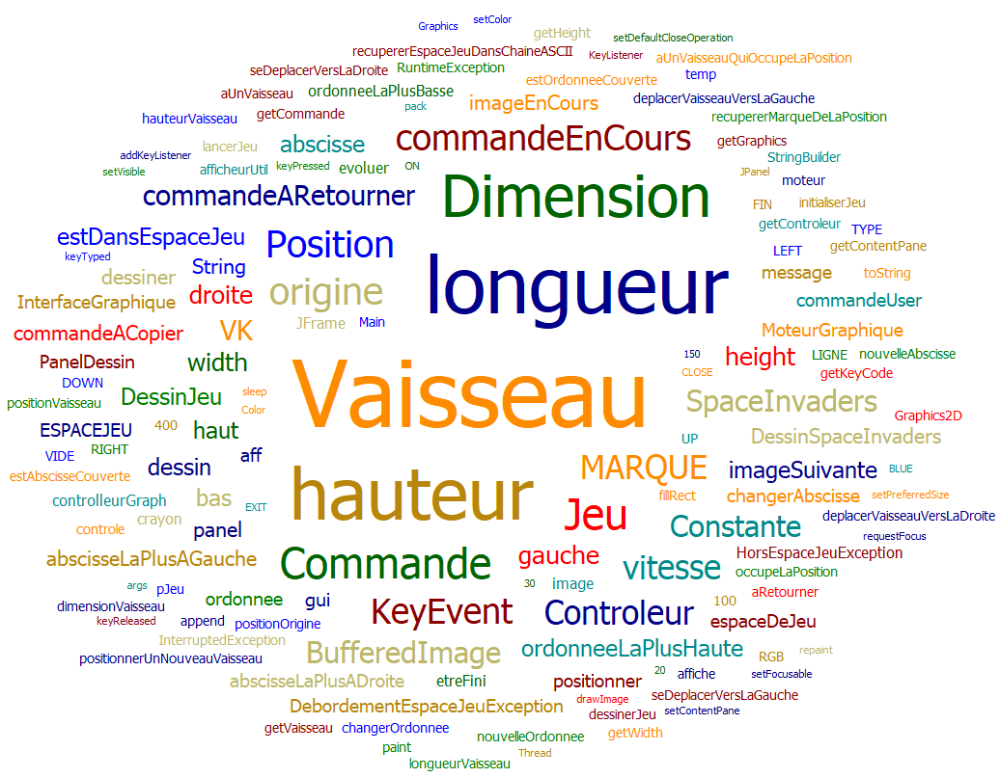
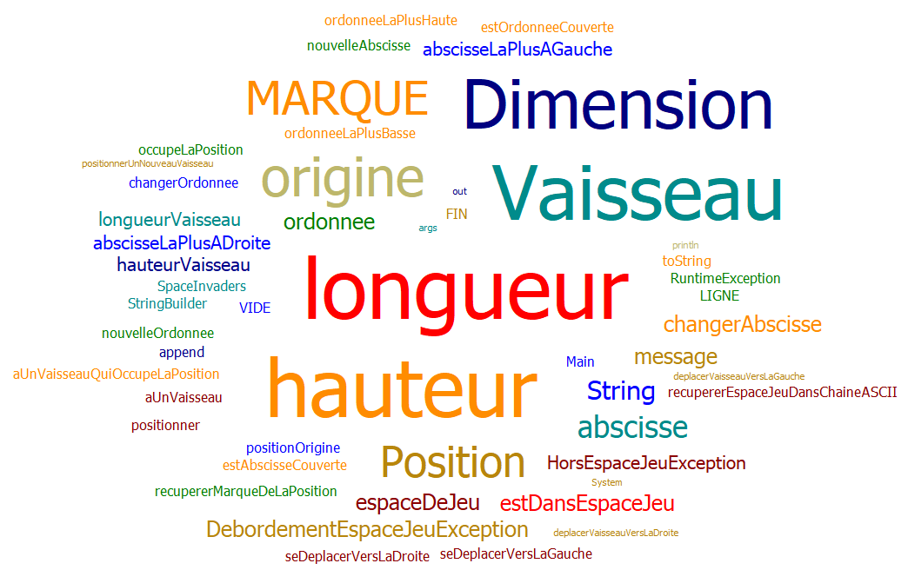
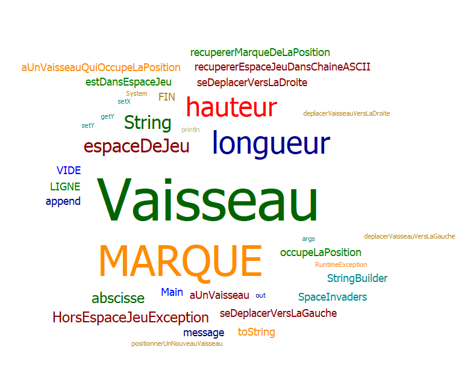

# Space invaders IUT

# Sommaire :
- [Semaine 1 : 30/03/2020 - 05/04/2020](#semaine1)
- [Semaine 2 : 04/05/2020 - 10/05/2020](#semaine2)
- [Semaine 3 : 11/05/2020 - 17/05/2020](#semaine3)
- [Glossaire](#glossaire)

## Semaine 3 
### Fonctionnalité 3 : Choisir la vitesse du vaisseau + **Implémentation du moteur graphique** 

- Story n°3.1 : Comprendre ce qu'est la vitesse dans notre application et faire un choix de conception.
Ajout de la définition de la vitesse au glossaire.

- Story n°3.2 : Ajouter la vitesse au Vaisseau sans régression de comportement.
Implémentation d'un attribut vitesse dans la classe Vaisseau. Refactoring des méthodes de la classe pour implémenter la vitesse.

- Story n°3.3 : Régler la vitesse du vaisseau.
Création d'un nouveau constructeur en surcharge de la classe Vaisseau qui a la signature : Vaisseau(Dimension, Position, int).

- Story n°3.4 : Faire en sorte que le déplacement se fasse correctement pour une vitesse quelconque.
Refactoring de la méthode positionnerUnNouveauVaisseau de la classe SpaceInvaders pour ajouter la vitesse à sa signature. refactoring de la classe SpaceInvadersTest pour inclure la vitesse dans tous les tests.

- Story n°3.5 : Refactoring.
Refactoring de la méthode initialiserJeu de la classe SpaceInvaders. Implémentation de la constante VAISSEAU_VITESSE dans la classe Constante

### Diagramme de classe : 

### Nuage de mots :

## Semaine 2 
### Fonctinnalité 2 : Dimensionner le vaisseau

- Story n°2.1 : Positionner un nouveau vaisseau avec une dimension donnée.
Un nouveau vaisseau est créé aux dimensions données (2D). Ce vaisseau est positionné aux coordonnées transmises.

- Story n°2.2 : Faire en sorte qu'il soit impossible de positionner un nouveau vaisseau qui déborde de l'espace de jeu.
Si un nouveau vaisseau essaye d’être positionné en dehors des limites de l’espace jeu, alors une exception est levée. Si une partie du vaisseau créé est en dehors des limites de l'espace de jeu, alors une exception est levée. Contraintes : La position souhaitée est transmise par ses coordonnées x et y. Le coin inférieur gauche du vaisseau correspond a l'origine du vaisseau.

- Story n°2.3 : Déplacer un vaisseau vers la droite en tenant compte de sa dimension.
Le vaisseau se déplace d'un pas vers la droite. Refactoring de la Story 1.3 en prenant en compte la largeur du vaisseau. Si le bord droit du vaisseau se trouve sur la bordure droite de l'espace de jeu, le vaisseau doit rester immobile.

- Story n°2.4 : Déplacer un vaisseau vers la droite en tenant compte de sa dimension.
Le vaisseau se déplace d'un pas vers la gauche. Refactoring de la Story 1.4 en prenant en compte la largeur du vaisseau. Si le bord gauche du vaisseau se trouve sur la bordure gauche de l'espace de jeu, le vaisseau doit rester immobile.

- Story n°2.5 : Refactoring.
Création des classes Position et Dimension. Implémentation de ces classes dans les classes SpaceInvaders et Vaisseau.

### Diagramme de classe : 

### Nuage de mots :

## Semaine 1 
### Fonctinnalité 1 : Déplacer vaisseau dans espace de jeu
- Story n°1.1 : Créer un espace de jeu  
Un espace de jeu est créé aux dimensions données (2D) 
Cet espace de jeu est vide

-  Story n°1.2 : Positionner un nouveau vaisseau dans l’espace de jeu  
Un nouveau vaisseau est créé
Le vaisseau est positionné aux coordonnées transmises
Si un nouveau vaisseau essaye d’être positionné en dehors des limites de l’espace jeu, alors une exception devra être levée.
 Contraintes :
La position souhaitée est transmise par ses coordonnées x et y.
Le coin supérieur gauche de l’espace jeu (point en haut à gauche) a pour coordonnées (0,0)
La taille du vaisseau est réduite pour l'instant à son minimum (1 seul point)

- Story n°1.3 : Déplacer le vaisseau vers la droite dans l'espace de jeu  
Le vaisseau se déplace d'un pas vers la droite 
Si le vaisseau se trouve sur la bordure droite de l'espace de jeu, le vaisseau doit rester immobile (aucun déplacement, aucune exception levée : le vaisseau reste juste à sa position actuelle).

- Story n°1.4 : Déplacer le vaisseau vers la gauche dans l'espace de jeu  
Le vaisseau se déplace d'un pas vers la gauche 
Si le vaisseau se trouve sur la bordure gauche de l'espace de jeu, le vaisseau doit rester immobile (aucun déplacement, aucune exception levée : le vaisseau reste juste à sa position actuelle).

### Diagramme de classe : 

### Nuage de mots :

## Glossaire 

**Vaisseau** : Véhicule commandé par le joueur, pouvant se déplacer de droite à gauche et ayant la possibilité de lancer des missiles destinés à détruire les envahisseurs.

**Envahisseur** : Ennemi qui apparaît à l'écran, se déplace automatiquement et qui doit être détruit par un missile lancé depuis le vaisseau du joueur.

**Missile** : Projectile envoyé à la verticale par le vaisseau vers l'envahisseur dans le but de le détruire.

**Vitesse** : Rapport de la longueur du chemin parcouru par le vaisseau au temps mis à le parcourir.

--------------------- 
